# Project Charter

## Business background

* Who is the client, what business domain the client is in.
	- Client would be Academic Research Team
	- Domain would be Cultural Analytics

* What business problems are we trying to address?
  	- There is widespread concern among film critics, scholars, and audiences that         contemporary cinema has become increasingly formulaic and homogenized.
  	- Are films objectively becoming more narratively similar over time?
  	- While concerns about narrative homogenization in film are frequently discussed in critical and popular discourse, they are typically framed in qualitative or anecdotal terms. Film scholars and critics often rely on selective case studies, personal interpretation, or genre-based intuition when arguing that contemporary cinema has become increasingly formulaic. This makes it difficult to assess whether such claims reflect a measurable trend or are influenced by cultural perception and recency bias. From a data science perspective, this presents an opportunity to reframe an abstract cultural debate as a quantitative problem. By analyzing large collections of movie scripts across decades and genres, this project aims to determine whether narrative structures are converging over time in a statistically detectable way. Addressing this question requires computational methods that can operate at scale and capture patterns that would be infeasible to identify through manual analysis alone.
  	  

## Scope
* What data science solutions are we trying to build?
	- Narrative Similarity Detection System
    - Genre Convergence Analyzer
* What will we do?
	- Collect movie scripts from public repo, gather metadata, clean and normalize,        segment for temporal analysis
    - Apply NLTK sentiment analysis to each narrative segment
    - Generate sentence embedding using BERT, apply dimensionality reduction for viz
    - For visualizations use sentiment arc overlays, embedding space projections
* How is it going to be consumed by the customer?
  - Using Interactive Notebooks, Technical Report, Dashboard and/or Presentation deck
  - The primary deliverables of this project will consist of quantitative metrics, visualizations, and supporting documentation that allow researchers to explore narrative similarity across films and time periods. The Narrative Similarity Detection System will produce similarity scores and comparative analyses that highlight how closely narrative arcs align within and across genres. The Genre Convergence Analyzer will enable users to examine whether traditionally distinct genres are becoming more structurally similar over time. These outputs will be presented through interactive notebooks and visual dashboards, allowing academic users to explore results dynamically rather than relying solely on static summaries. The project is intended to support exploratory and interpretive research rather than predictive modeling, with an emphasis on transparency and interpretability. Results will be suitable for inclusion in academic papers, presentations, and classroom discussions related to film studies and cultural analytics.

## Personnel
* Team members will collaborate across data collection, analysis, and reporting tasks, with responsibilities distributed to ensure balanced workload and shared understanding of the system. Collaboration will involve pair-based development, shared code repositories, and regular review of analytical outputs. Each member will contribute to both technical implementation and interpretation of results to support a cohesive final deliverable.
* Who are on this project:
	* Micah
    * Dimitri
    * Ankur
    * Vishwa
    * Vishrut
	
## Metrics
* What are the qualitative objectives? (e.g. reduce user churn)
	- Reduce uncertainty about narrative trends
 	- Quantify creative diversity
 	- Benchmark genre distinctiveness
* What is a quantifiable metric  (e.g. reduce the fraction of users with 4-week inactivity)
	- Narrative Arc Similarity, Narrative Transition Entropy, Genre Conergence Ratio
  
* Quantify what improvement in the values of the metrics are useful for the customer scenario (e.g. reduce the  fraction of users with 4-week inactivity by 20%)
	- Detect >= 20% increase in Narrative Arc Similarity
* What is the baseline (current) value of the metric? (e.g. current fraction of users with 4-week inactivity = 60%)
	- Baseline can be 1980-1995 subset of movies. Can be used a reference point
* How will we measure the metric? (e.g. A/B test on a specified subset for a specified period; or comparison of performance after implementation to baseline)
  	- Project success is defined as identifying statistically detectable trends in narrative similarity or genre convergence relative to the baseline period. Project failure is defined as metrics showing no distinguishable patterns beyond noise or results that are not interpretable.
  	- The selected metrics are designed to capture different aspects of narrative structure and diversity in a complementary manner. Narrative Arc Similarity measures the degree to which emotional or thematic progression follows similar patterns across films, providing a direct way to assess structural convergence. Narrative Transition Entropy captures the variability in how stories move between narrative phases, with lower entropy indicating more predictable or formulaic transitions. The Genre Convergence Ratio compares within-genre and cross-genre similarity to assess whether genre boundaries are becoming less distinct over time. These types of metrics are commonly used in natural language processing and cultural analytics to study structural regularity, diversity, and change. Rather than serving as absolute indicators of quality, the metrics are interpreted comparatively across time periods and genres to identify meaningful trends.

## Plan
* Phases (milestones), timeline, short description of what we'll do in each phase.
	- The project phases are structured to ensure that analytical results are grounded in reliable data and reproducible processes. Initial data collection and validation establish feasibility and help identify potential data quality issues early. Pipeline development focuses on creating repeatable preprocessing and feature extraction steps that can be applied consistently across the dataset. Analytical and visualization phases are iterative, allowing insights from preliminary results to inform refinement of metrics and representations. Integration, validation, and documentation ensure that findings are interpretable, well-supported, and suitable for academic dissemination.
	- Collect initial data and validate feasibility
   	- Data Processing and Pipeline Development
   	- Anlytics and Metrics
   	- Visualizations
   	- Integration and Validation
   	- Documenting and Reporting 
## Architecture
* The system architecture is designed as a modular pipeline that supports reproducible analysis and iterative exploration. Movie scripts and metadata are first collected from public and academic sources, then stored in a raw format to preserve original content. Preprocessing steps include cleaning, normalization, and segmentation of scripts into narrative units that can be analyzed consistently across films. Feature extraction is performed on these processed segments using sentiment analysis and language model embeddings, allowing both emotional trajectories and semantic structure to be captured. Analytical components compute similarity, entropy, and convergence metrics, which are then passed to visualization modules for interpretation. This separation of data ingestion, processing, analysis, and visualization allows components to be modified or extended independently as the project evolves.
* Data
  * What data do we expect? Raw data in the customer data sources (e.g. on-prem files, SQL, on-prem Hadoop etc.)
    - IMSDb (web scraping HTML parsing)
    - Cornell Movie Dialogs Corpus (academic dataset)
* Data movement from on-prem to Azure using ADF or other data movement tools (Azcopy, EventHub etc.) to move either
  * all the data, 
  * after some pre-aggregation on-prem,
  * Sampled data enough for modeling

 	 - [Web Sources]      →    [Python Scrapers]   →         [Local Storage]
     -  (IMSDb TMDB api)  →     (requests/BS4)     →         /data/raw/scripts or metadata
         

* What tools and data storage/analytics resources will be used in the solution e.g.,
  * ASA for stream aggregation
  * HDI/Hive/R/Python for feature construction, aggregation and sampling
  * AzureML for modeling and web service operationalization

 	 - Google Drive, Github
     - Colab or Jupyter for compute and running GPU/TPU
     - No cloud based solutions is requiered for now
  
* How will the score or operationalized web service(s) (RRS and/or BES) be consumed in the business workflow of the customer? If applicable, write down pseudo code for the APIs of the web service calls.
  * How will the customer use the model results to make decisions
    * The customer will use similarity and convergence metrics to support or challenge claims of narrative homogenization in academic research. Visualizations will be used to compare genres and time periods in papers, presentations, and exploratory analyses.
  * Data movement pipeline in production
  * Make a 1 slide diagram showing the end to end data flow and decision architecture
    * If there is a substantial change in the customer's business workflow, make a before/after diagram showing the data flow.
    	### End-to-End Data Flow 

```mermaid
graph LR
    A[Data Sources] --> B[Collection]
    B --> C[Raw Storage]
    C --> D[Preprocessing]
    D --> E[Processed Data]
    E --> F[Feature Extraction]
    F --> G[Analysis]
    G --> H[Visualization]
    H --> I[Report]
    
    style A fill:#e3f2fd
    style B fill:#fff9c4
    style C fill:#f5f5f5
    style D fill:#fff9c4
    style E fill:#f5f5f5
    style F fill:#f3e5f5
    style G fill:#e8f5e9
    style H fill:#fce4ec
    style I fill:#fff3e0
```

**Stages:**
1. **Data Sources:** IMSDb, TMDB, Cornell Corpus
2. **Collection:** Python scrapers (requests, BeautifulSoup)
3. **Raw Storage:** scripts + metadata
4. **Preprocessing:** Cleaning, segmentation, validation
5. **Processed Data:** Cleaned + structured
6. **Feature Extraction:** Sentiment arcs, embeddings, phases
7. **Analysis:** Similarity, entropy, convergence metrics
8. **Visualization:** Plots, charts, heatmaps
9. **Report:** Technical document + presentation

## Data Limitations and Bias
Script availability may bias the dataset toward popular or English-language films. OCR and formatting inconsistencies may introduce noise, particularly in older scripts.

## Communication
* How will we keep in touch? Weekly meetings?
	- Discord, Outlook, Github, Zoom or inperson.
    - Weekly time commitment: 6 hrs or more
    - These communication platforms are selected to support both asynchronous coordination and real-time discussion. GitHub will be used for version control and documentation, while Discord and Zoom will facilitate rapid feedback and collaborative problem-solving. Regular meetings help ensure alignment across project phases and allow early identification of technical or analytical challenges.
* Who are the contact persons on both sides?
