# Project Charter

## Business background

* Who is the client, what business domain the client is in.
	- Client would be Academic Research Team
	- Domain would be Cultural Analytics

* What business problems are we trying to address?
  	- There is widespread concern among film critics, scholars, and audiences that         contemporary cinema has become increasingly formulaic and homogenized.
  	- Are films objectively becoming more narratively similar over time?
  	  

## Scope
* What data science solutions are we trying to build?
	- Narrative Similarity Detection System
    - Genre Convergence Analyzer
* What will we do?
	- Collect movie scripts from public repo, gather metadata, clean and normalize,        segment for temporal analysis
    - Apply NLTK sentiment analysis to each narrative segment
    - Generate sentence embedding using BERT, apply dimensionality reduction for viz
    - For visualizations use sentiment arc overlays, embedding space projections
* How is it going to be consumed by the customer?
  - Using Interactive Notebooks, Technical Report, Dashboard and/or Presentation deck

## Personnel
* Who are on this project:
	* Micah
    * Dimitri
    * Ankur
    * Vishwa
    * Vishrut
	
## Metrics
* What are the qualitative objectives? (e.g. reduce user churn)
	- Reduce uncertainty about narrative trends
 	- Quantify creative diversity
 	- Benchmark genre distinctiveness
* What is a quantifiable metric  (e.g. reduce the fraction of users with 4-week inactivity)
	- Narrative Arc Similarity, Narrative Transition Entropy, Genre Conergence Ratio
  
* Quantify what improvement in the values of the metrics are useful for the customer scenario (e.g. reduce the  fraction of users with 4-week inactivity by 20%)
	- Detect >= 20% increase in Narrative Arc Similarity
* What is the baseline (current) value of the metric? (e.g. current fraction of users with 4-week inactivity = 60%)
	- Baseline can be 1980-1995 subset of movies. Can be used a reference point
* How will we measure the metric? (e.g. A/B test on a specified subset for a specified period; or comparison of performance after implementation to baseline)
  	- Project success is defined as identifying statistically detectable trends in narrative similarity or genre convergence relative to the baseline period. Project failure is defined as metrics showing no distinguishable patterns beyond noise or results that are not interpretable.

## Plan
* Phases (milestones), timeline, short description of what we'll do in each phase.
	- Collect initial data and validate feasibility
   	- Data Processing and Pipeline Development
   	- Anlytics and Metrics
   	- Visualizations
   	- Integration and Validation
   	- Documenting and Reporting 
## Architecture
* Data
  * What data do we expect? Raw data in the customer data sources (e.g. on-prem files, SQL, on-prem Hadoop etc.)
    - IMSDb (web scraping HTML parsing)
    - Cornell Movie Dialogs Corpus (academic dataset)
* Data movement from on-prem to Azure using ADF or other data movement tools (Azcopy, EventHub etc.) to move either
  * all the data, 
  * after some pre-aggregation on-prem,
  * Sampled data enough for modeling

 	 - [Web Sources]      →    [Python Scrapers]   →         [Local Storage]
     -  (IMSDb TMDB api)  →     (requests/BS4)     →         /data/raw/scripts or metadata
         

* What tools and data storage/analytics resources will be used in the solution e.g.,
  * ASA for stream aggregation
  * HDI/Hive/R/Python for feature construction, aggregation and sampling
  * AzureML for modeling and web service operationalization

 	 - Google Drive, Github
     - Colab or Jupyter for compute and running GPU/TPU
     - No cloud based solutions is requiered for now
  
* How will the score or operationalized web service(s) (RRS and/or BES) be consumed in the business workflow of the customer? If applicable, write down pseudo code for the APIs of the web service calls.
  * How will the customer use the model results to make decisions
    * The customer will use similarity and convergence metrics to support or challenge claims of narrative homogenization in academic research. Visualizations will be used to compare genres and time periods in papers, presentations, and exploratory analyses.
  * Data movement pipeline in production
  * Make a 1 slide diagram showing the end to end data flow and decision architecture
    * If there is a substantial change in the customer's business workflow, make a before/after diagram showing the data flow.
    	### End-to-End Data Flow 

```mermaid
graph LR
    A[Data Sources] --> B[Collection]
    B --> C[Raw Storage]
    C --> D[Preprocessing]
    D --> E[Processed Data]
    E --> F[Feature Extraction]
    F --> G[Analysis]
    G --> H[Visualization]
    H --> I[Report]
    
    style A fill:#e3f2fd
    style B fill:#fff9c4
    style C fill:#f5f5f5
    style D fill:#fff9c4
    style E fill:#f5f5f5
    style F fill:#f3e5f5
    style G fill:#e8f5e9
    style H fill:#fce4ec
    style I fill:#fff3e0
```

**Stages:**
1. **Data Sources:** IMSDb, TMDB, Cornell Corpus
2. **Collection:** Python scrapers (requests, BeautifulSoup)
3. **Raw Storage:** scripts + metadata
4. **Preprocessing:** Cleaning, segmentation, validation
5. **Processed Data:** Cleaned + structured
6. **Feature Extraction:** Sentiment arcs, embeddings, phases
7. **Analysis:** Similarity, entropy, convergence metrics
8. **Visualization:** Plots, charts, heatmaps
9. **Report:** Technical document + presentation

## Data Limitations and Bias
Script availability may bias the dataset toward popular or English-language films. OCR and formatting inconsistencies may introduce noise, particularly in older scripts.

## Communication
* How will we keep in touch? Weekly meetings?
	- Discord, Outlook, Github, Zoom or inperson.
    - Weekly time commitment: 6 hrs or more
* Who are the contact persons on both sides?
